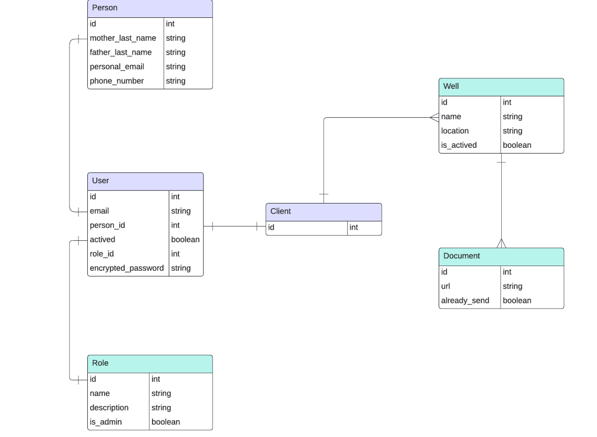

# Diagramas ER

## Modelos actuales
- User: entidad que engloba a usuarios, con atributos relacionados al inicio de cuenta y los permisos que se tienen.
- Person: entidad que contiene información sensible de cada usuario.
- Client: entidad que engloba a usuarios que tienen pozos asignados. Los crea el usuario admin.
- Well: entidad que define a cada pozo.
- WellData: entidad que contiene todos los reportes de datos de cada pozo. Se debería crear 1 por hora durante las 24 horas del día.
- Role: entidad que maneja los diferentes permisos que tiene cada usuario.

 